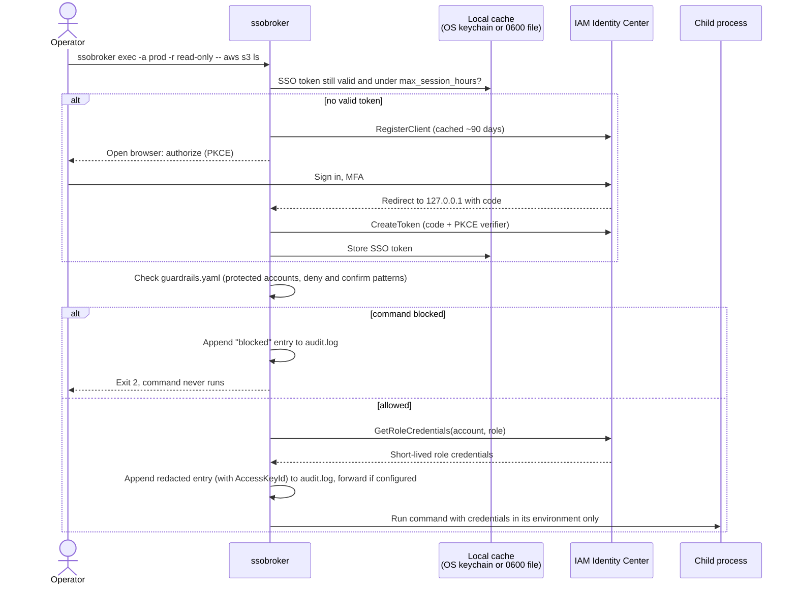

# aws-sso-broker

[](https://github.com/DustyStudy/aws-sso-broker/actions/workflows/ci.yml)
[](https://github.com/DustyStudy/aws-sso-broker/actions/workflows/codeql.yml)
[](https://securityscorecards.dev/viewer/?uri=github.com/DustyStudy/aws-sso-broker)
[](LICENSE)

**Ephemeral AWS multi-account credential broker, built on IAM Identity Center (SSO).**
The CLI command is `ssobroker`.

No long-lived access keys. No static credentials sitting in `~/.aws/credentials`.
Log in once via your org's Identity Center portal, then run commands or open a
shell against any account/role you're granted, with short-lived, auto-expiring
credentials and a local audit trail.

**Verified live:** two runs against a real Identity Center organization, with
all 12 hardening claims proven. The second run caught a regression that would
have forced users to sign in every hour, fixed before release.
[Evidence](docs/PROOF.md).

## Why

Most teams either hand out long-lived IAM user keys (bad) or make people
click through the AWS SSO web console and copy-paste temporary credentials
by hand every hour (annoying). `ssobroker` automates the second option: it
drives the same Identity Center sign-in the AWS CLI uses,
caches the resulting short-lived credentials locally, and exposes a simple
CLI (`exec`, `shell`) for using them.

## How it works



The broker never holds a long-lived key: the SSO token and role credentials
both expire on their own, and `ssobroker logout` signs the session out at AWS
and clears them early.
[`docs/THREAT_MODEL.md`](docs/THREAT_MODEL.md) covers what the local
guardrails do and do not protect against.

## Features

- **SSO-only sign-in**: the authorization-code grant with PKCE and a
  `127.0.0.1` redirect. There is no code path that accepts or stores a
  long-lived access key.
- **`exec` and `shell`**: run one command, or open a subshell, with
  credentials in that process's environment only.
- **`credential_process` support**: `creds-process` and `sync-aws-config`
  let `aws`, `terraform` and boto3 work with plain `--profile`.
- **Local guardrails**: protected accounts and deny/confirm patterns that
  stop an obviously wrong command before it reaches AWS. This is a
  client-side speed bump, not a replacement for IAM permission boundaries
  or SCPs.
- **Audit log**: one redacted JSON line per credential use, with the
  temporary `AccessKeyId` (the join key to CloudTrail). It can forward to
  syslog, the Windows Event Log or CloudWatch Logs.
- **Hardened cache**: owner-only files or the OS keychain, with cached role
  credentials tied to the SSO session that fetched them.
- **`doctor`**: warns about long-lived access keys and AWS CLI SSO tokens
  left on disk, the files commodity infostealers copy.
- **Admin-managed policy**: pin the allowed start URLs, cap session length
  and enforce guardrails. It can only tighten a user's settings.
- **Verifiable releases**: wheel, sdist, hash-locked requirements and a
  CycloneDX SBOM, each with a signed build-provenance attestation.

The full list is in [docs/USAGE.md](docs/USAGE.md#features).

## Install

### Verified release (recommended for organizations)

Download the wheel and `runtime-requirements.txt` from the
[latest release](https://github.com/DustyStudy/aws-sso-broker/releases/latest), then:

```bash
gh attestation verify aws_sso_broker-*.whl --repo DustyStudy/aws-sso-broker
python3 -m pip install --require-hashes -r runtime-requirements.txt
python3 -m pip install --no-deps aws_sso_broker-*.whl
```

See [docs/ENTERPRISE.md](docs/ENTERPRISE.md) for fleet rollout.

### pipx (recommended for CLI-only use)

If you just want the `ssobroker` command available globally without managing a
virtualenv yourself:

```bash
pipx install git+https://github.com/DustyStudy/aws-sso-broker.git
```

Installing from source, the OS keychain extra, shell completion and
upgrading from `orgctl` are covered in
[docs/USAGE.md](docs/USAGE.md#install-options).

## Quick start

```bash
# 1. Create your local account registry from the example
ssobroker init
$EDITOR ~/.ssobroker/orgs.yaml   # add your SSO start URL + account IDs/roles

# 2. Sanity-check everything, including AWS CLI credentials left on disk
ssobroker doctor          # --strict exits 1 if any are found

# 3. Log in (opens your browser to sign in to Identity Center)
ssobroker login
#    On a machine with no local browser:
ssobroker login --use-device-code

# 4. See what's in your registry
ssobroker accounts

# 5. See what Identity Center actually grants you right now
ssobroker list-remote

# 6. Run something
ssobroker exec -a prod -r read-only -- aws s3 ls

# 7. Or work interactively
ssobroker shell -a prod -r read-only
```

## More commands and configuration

[docs/USAGE.md](docs/USAGE.md) covers the rest: `creds-process`,
`sync-aws-config`, `export-env`, `check-policy`, `whoami`, `audit-log` and
`--json` output, plus `orgs.yaml`, `guardrails.yaml` and the managed policy.
[docs/ENTERPRISE.md](docs/ENTERPRISE.md) covers fleet rollout.

## Security model

- Credentials are always short-lived (from AWS SSO's `GetRoleCredentials`),
  scoped to exactly the account/role requested, and expire on their own.
- `exec` and `shell` never touch the parent shell's own environment:
  credentials exist only in the memory of the one child process/subshell
  spawned for that command. `export-env` and `creds-process` are the
  deliberate exceptions: printing credentials to stdout (for `eval` into
  your *current* shell, or for AWS tooling's `credential_process` protocol)
  is their whole point, not a leak; see [docs/USAGE.md](docs/USAGE.md#commands).
- `ssobroker logout` signs the SSO session out at AWS and clears every
  cached token/credential immediately.
- Cached role credentials are only reused under the SSO session that fetched
  them, so a re-login, logout or different Identity Center instance never
  gets old credentials back.
- Guardrails and the audit log are local-only conveniences, not a substitute
  for IAM permission boundaries, SCPs, or CloudTrail.

See [`docs/THREAT_MODEL.md`](docs/THREAT_MODEL.md) for the full breakdown:
assets, trust boundaries, per-scenario mitigations and residual risk, and
what's explicitly out of scope.

## Why not `aws configure sso`, aws-vault or Granted?

Use them if they cover what you need. The AWS CLI's own SSO support handles
sign-in and profiles well. `ssobroker` adds a few things around that:

- **Guardrails before the call leaves the machine**: protected accounts and
  deny/confirm patterns, which catch the wrong-terminal-tab mistake.
- **An audit trail tied to CloudTrail**: every credential use is logged with
  its temporary `AccessKeyId`, redacted, and optionally forwarded to your SIEM.
- **Admin-managed policy**: a security team can pin start URLs, turn off
  device-code sign-in and enforce guardrails on every endpoint.
- **Safe `~/.aws/config` generation**: `sync-aws-config` writes one
  `credential_process` profile per account/role from a single registry
  without touching anything it didn't create.

None of these replace IAM, SCPs or CloudTrail; see the security model above.

## Proof

Run for real against a real IAM Identity Center instance, twice, and
verified against AWS's own responses. The first run covered credentials,
guardrails, audit logging, `sync-aws-config` and logout, and found nothing.
The second covered the corporate hardening: PKCE sign-in, server-side logout
(the old token is rejected by AWS afterwards), the managed policy, redaction,
CloudWatch forwarding, and finding the audit log's `access_key_id` in
CloudTrail. It found that users would have had to sign in every hour, which
was fixed before release. See [`docs/PROOF.md`](docs/PROOF.md).

## Development

```bash
python3 -m pip install -e ".[dev]"
ruff check src tests
ruff format src tests
mypy src
pytest -v --cov=ssobroker --cov-report=term-missing
```

See [CONTRIBUTING.md](CONTRIBUTING.md) for the full workflow (including
optional `pre-commit` hooks) and [SECURITY.md](.github/SECURITY.md) for
the vulnerability-reporting process and which areas get the most scrutiny.

## License

MIT, see [LICENSE](LICENSE).
